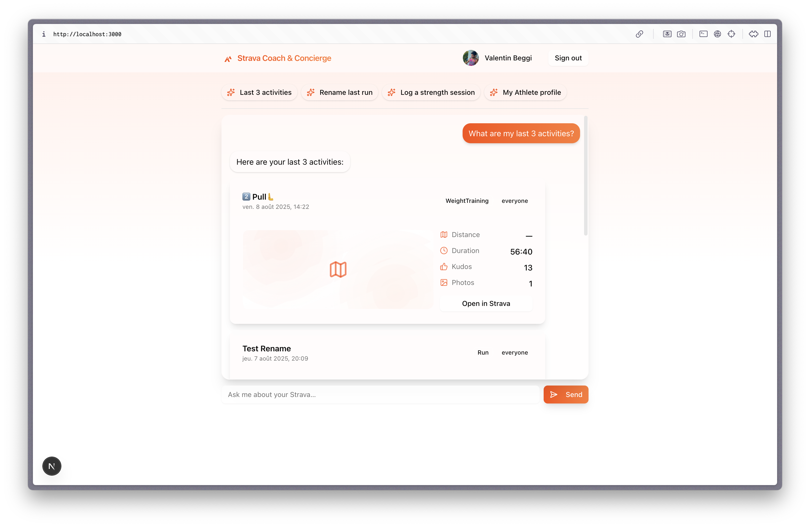

# Strava Coach & Concierge



# install deps

pnpm install

# create db + run migrations

pnpm run db:generate
pnpm run db:migrate

Duplicate .env.example to .env.local and fill in the values:

```bash

SQLITE_PATH=.data/app.db
OPENAI_API_KEY=YOUR_OPENAI_KEY

# Auth.js (NextAuth v5)

AUTH_SECRET=your-random-long-string
AUTH_URL=http://localhost:3000

# Strava OAuth (from https://www.strava.com/settings/api)

AUTH_STRAVA_ID=xxx
AUTH_STRAVA_SECRET=xxx

# MCP (internal auth between web and MCP server)

MCP_INTERNAL_TOKEN=dev-internal-bearer
```

In Strava app settings, set redirect to: localhost

Sign in with Strava in the header.

2. Use the chat
   Some handy prompts (also available as quick chips):

“What are my last 3 activities?”

“Rename my last run to Test Rename”

“Log a 45-min strength session yesterday at 18:15 (private) with a name you choose”

“Who am I ?” (shows your athlete profile)

3. MCP (Model Context Protocol)
   The app exposes an MCP server over Streamable HTTP at /api/mcp.
   It includes tools like strava.getRecentActivities, strava.renameActivity, strava.createManualActivity, and a resource strava://athlete.
